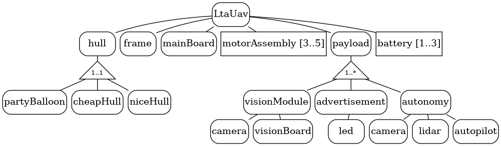
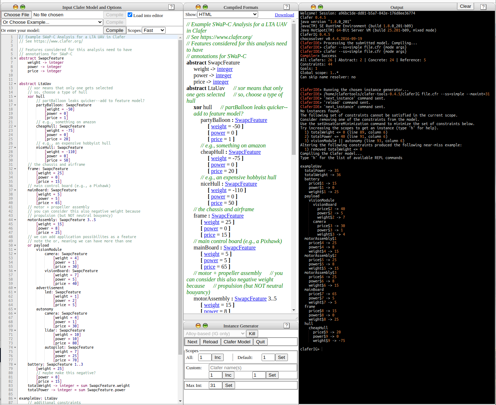

# SWaP-C-analysis

Example SWaP-C (Size, Weight, Power, and Cost) analysis in the Clafer modeling language.



## Usage

## Web (easiest)
The easiest method is to visit the [web claferIDE](http://t3-necsis.cs.uwaterloo.ca:8094/) and paste in the [clafer file](./ltauav.cfr).
* Click compile
* In the instance generator, click Run
* After a bit, a uav feature set should populate in the output pane. If not, click Next.




## Local

Install the [Clafer tools distribution](https://gsd.uwaterloo.ca/clafer-tools-binary-distributions.html). In a shell, run
```shell
claferIG ltauav.cfr
```
